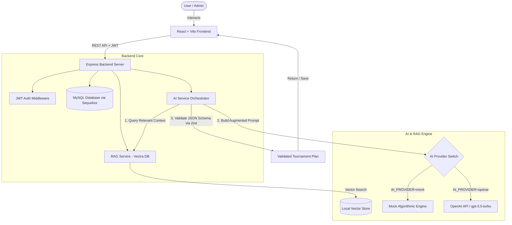

# 🏆 AI Sports Tournament Planner

> **Plan Smarter. Play Better.**  
> An intelligent, full-stack AI-powered sports tournament management system with built-in **Retrieval-Augmented Generation (RAG)** and **Automated Schedule Planning**.

---

## 🌟 Key Features

* 🤖 **AI Tournament Schedule Generator**: Generates comprehensive, conflict-free match schedules (Knockout, Round-Robin, Group + Knockout), venue/ground assignments, time slots, and tournament rules automatically.
* 📚 **RAG Rulebook Knowledge Base**: Upload custom tournament rulebooks and guidelines (PDF, TXT, DOCX). The system chunks, vectorizes, and indexes document passages to ground AI responses in official rules.
* 💬 **Interactive AI Studio & Assistant**: Context-aware AI assistant capable of answering complex tournament queries, format recommendations, and rule interpretations.
* 🛡️ **Dual AI Mode (Offline Mock & Real LLM)**:
  * **Offline Mode (Default)**: Works 100% free out-of-the-box without requiring an API key, using deterministic scheduling algorithms and local hash vector embeddings.
  * **OpenAI Mode**: Connects seamlessly to OpenAI (`gpt-3.5-turbo` / `gpt-4` and `text-embedding-3-small`) with a single environment flag.
* 📊 **Live Analytics Dashboard**: Real-time breakdown of active tournaments, matches played, team counts, and category statistics.
* ⚔️ **Complete Tournament Management**: Full CRUD management for Tournaments, Teams, Players, Matches, and Venues.

---

## 🛠️ Technology Stack

| Domain | Technologies |
| :--- | :--- |
| **Frontend** | React 18, Vite, Tailwind CSS, Lucide React, Axios |
| **Backend** | Node.js, Express.js, Sequelize ORM, MySQL 8, Zod, JWT |
| **AI Engine** | OpenAI API SDK, Custom Offline Algorithmic Generator, Zod Schema Enforcer |
| **RAG & Vectors** | Vectra (Local Vector Database), `pdf-parse`, Custom 384d Vector Embedder |

---

## 🏗️ Architecture Overview



---

## 🚀 Quick Start Guide

### Prerequisites
* **Node.js** `v18.0.0` or higher
* **MySQL** `v8.0` running locally

---

### Step 1: Backend Setup

```bash
# 1. Navigate to backend directory
cd backend

# 2. Install dependencies
npm install

# 3. Create .env configuration file from template
cp .env.example .env

# 4. Update your MySQL credentials in .env (DB_USER, DB_PASS, DB_NAME)

# 5. Run Database Migration & Seed Data
npm run seed

# 6. Start backend dev server (Runs on http://localhost:5000)
npm run dev
```

---

### Step 2: Frontend Setup

```bash
# 1. Open a new terminal and navigate to frontend directory
cd frontend

# 2. Install dependencies
npm install

# 3. Start frontend dev server (Runs on http://localhost:5173)
npm run dev
```

---

### 🔑 Demo Login Credentials

Once the seed script has completed, log in with the following default admin account:

* **Email:** `demo@planner.com`
* **Password:** `demo1234`

---

## ⚙️ Environment Configuration

Backend environment settings are configured in `backend/.env`:

| Variable | Default Value | Description |
| :--- | :--- | :--- |
| `PORT` | `5000` | Backend API Server Port |
| `DB_HOST` | `localhost` | MySQL Database Host |
| `DB_PORT` | `3306` | MySQL Port |
| `DB_NAME` | `sports_planner` | Database Name |
| `DB_USER` | `root` | MySQL User |
| `DB_PASS` | `""` | MySQL Password |
| `JWT_SECRET` | `super_secret_jwt_key` | Secret key for JWT Token signing |
| `AI_PROVIDER` | `mock` | AI Engine Mode (`mock` or `openai`) |
| `AI_API_KEY` | `""` | OpenAI API Key (Required only if `AI_PROVIDER=openai`) |
| `AI_MODEL` | `gpt-3.5-turbo` | OpenAI Model choice |

---

## 🧠 LLM & RAG Configuration

### Offline / Free Mode (Default)
No API key required! Setting `AI_PROVIDER=mock` activates:
* **Mock LLM**: Algorithmic schedule generator enforcing ground limits, time slots, and tournament formats.
* **Mock Vector RAG**: Local 384-dimensional hash vectorizer that enables PDF uploading, chunking, and similarity search without external calls.

### Real OpenAI Integration
To enable live OpenAI generation & official embeddings:
1. Edit `backend/.env`:
   ```env
   AI_PROVIDER=openai
   AI_API_KEY=sk-your-actual-openai-api-key
   ```
2. Restart the backend server (`npm run dev`).

---

## 🔌 API Reference

All protected endpoints require an `Authorization: Bearer <token>` header.

### 🔑 Authentication
| Method | Endpoint | Description |
| :--- | :--- | :--- |
| `POST` | `/api/auth/register` | Register a new user account |
| `POST` | `/api/auth/login` | Authenticate user and receive JWT token |
| `GET` | `/api/auth/profile` | Get current authenticated user profile |

### 🤖 AI Studio & Planning
| Method | Endpoint | Description |
| :--- | :--- | :--- |
| `POST` | `/api/ai/generate-plan` | Generate AI plan using prompt + RAG context |
| `POST` | `/api/ai/save-plan` | Convert & persist AI plan into DB tournaments & matches |
| `POST` | `/api/ai/chat` | Send message to AI assistant with RAG context lookup |

### 📚 Knowledge Base (RAG Documents)
| Method | Endpoint | Description |
| :--- | :--- | :--- |
| `GET` | `/api/documents` | List all uploaded knowledge documents |
| `POST` | `/api/documents/upload` | Upload PDF/TXT rulebook & trigger RAG vector indexing |
| `DELETE` | `/api/documents/:id` | Delete document and remove from vector store |

### 🏆 Resources & Management
| Method | Endpoint | Description |
| :--- | :--- | :--- |
| `GET/POST` | `/api/tournaments` | List / Create Tournaments |
| `GET/PUT/DELETE` | `/api/tournaments/:id` | Read / Update / Delete Tournament |
| `GET/POST` | `/api/teams` | List / Create Teams |
| `GET/POST` | `/api/players` | List / Create Players |
| `GET/POST` | `/api/matches` | List / Create Matches |
| `GET` | `/api/dashboard/stats` | Fetch aggregate stats for dashboard metrics |

---

## 📁 Project Directory Structure

```text
ai-sports-tournament-planner/
├── backend/
│   ├── config/              # Database connection & Sequelize configuration
│   ├── middleware/          # Authentication & error handling middleware
│   ├── models/              # Sequelize models (User, Tournament, Match, Team, Document, etc.)
│   ├── routes/              # Express API route controllers
│   ├── services/
│   │   ├── aiService.js     # AI prompt orchestration & Zod schema validation
│   │   ├── ragService.js    # Document ingestion, vector embedding & Vectra indexer
│   │   ├── tournamentService.js # Scheduling math & knockout/round-robin logic
│   │   └── providers/
│   │       ├── mock.js      # Offline fallback AI provider
│   │       └── openai.js    # Live OpenAI provider
│   ├── uploads/             # Document storage & Vectra vector database files
│   ├── schema.sql           # Raw database schema reference
│   ├── seed.js              # Database initialization & sample data generator
│   └── server.js            # Main Express app entrypoint
├── frontend/
│   ├── src/
│   │   ├── components/      # UI components (Navbar, Sidebar, Modals, Cards)
│   │   ├── context/         # Auth & global state context
│   │   ├── pages/           # Page views (Dashboard, AIStudio, Knowledge, Resources)
│   │   ├── services/        # Axios API client functions
│   │   ├── App.jsx          # App router & layout container
│   │   └── main.jsx         # React DOM entrypoint
```

---

## 📝 License

Distributed under the MIT License. See `LICENSE` for more information.
